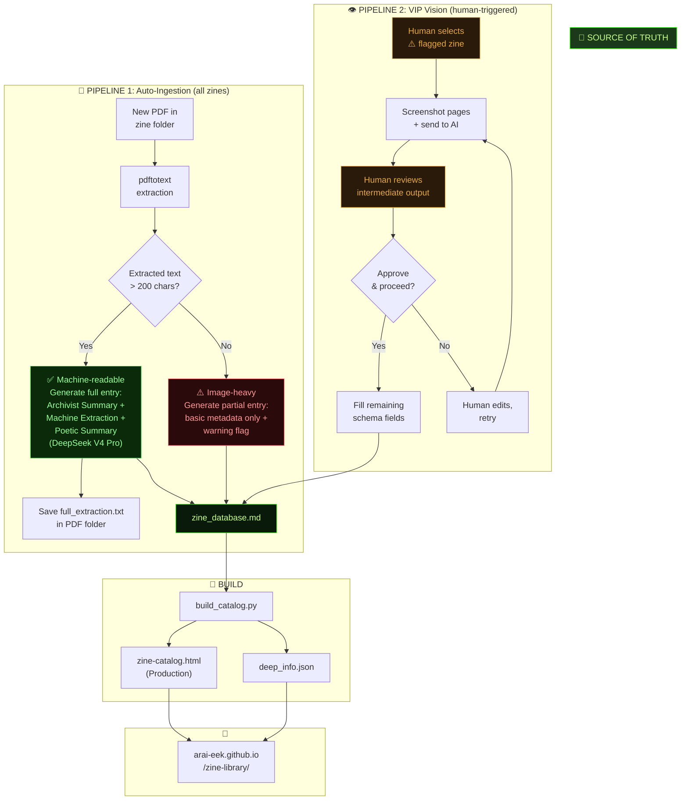

# Implementation Plan - Zine Library Catalog Consolidation

Modernizing and stabilizing the Arai-eek Zine Library catalog into a canonical, static-first archival system.

## System Architecture & Workflow

## Key Learnings & Course Corrections

### 1. Thumbnail Canonicalization
- **Issue**: Many ZIDs were missing the `Thumbnail:` field or had broken links due to filename inconsistencies (spaces vs. underscores).
- **Correction**: Performed a full audit and fixed 8 ZIDs. Every entry now requires a `Thumbnail:` field in the metadata block.
- **Markdown Previews**: Added `` previews directly to `zine_database.md` to enable visual browsing within the repository.

### 2. Multi-Tab UI Logic
- **Discovery**: "Key Concepts" are critical for both machine-readability and poetic synthesis.
- **Correction**: Updated the rendering logic to display Key Concepts in both the "Factual Read" and "Poetic Deep" tabs.
- **State Management**: Implemented a stateless `renderContent` function in the build pipeline to handle tab switching without external dependencies.

### 3. Agentic Transparency
- **Requirement**: Clearly distinguish between human curatorial intent and machine-scale narrative synthesis.
- **Correction**: Re-integrated the orange **SPECULATIVE SYNTHESIS** warning banner and the **MULTI-MODEL SYNTHESIS LOGS** modal documenting the Claude-Gemini-DeepSeek relay.

## Proposed System Architecture

### Canonical Source: [zine_database.md](file:///home/dusjagr/Documents/Hackteria/mega/Projects/2026_Projects/CoLabs/Arai-eek_zines/PRINT-READY/zine_database.md)
The single source of truth for all zine data.
- **Schema**: Metadata block + 5 narrative sections (Archivist, Machine, Poetic, Concepts, Fragments).
- **Visuals**: Embedded Markdown images for repository-side browsing.

### Build Pipeline: [build_catalog.py](file:///home/dusjagr/Documents/Hackteria/mega/Projects/2026_Projects/CoLabs/Arai-eek_zines/PRINT-READY/build_catalog.py)
Automated script that parses the database and generates:
1. `deep_info.json`: Compressed metadata for the dossier viewer.
2. `zine-catalog.html`: High-fidelity static web interface with CRT aesthetics.

### Ingestion Tools
- **[ingest_zine.py](file:///home/dusjagr/Documents/Hackteria/mega/Projects/2026_Projects/CoLabs/Arai-eek_zines/PRINT-READY/ingest_zine.py)**: Helper script to automate the technical part of ingestion (PDF metadata, 300x400 thumbnails, layout-aware text extraction).
- **[reextract_all.py](file:///home/dusjagr/Documents/Hackteria/mega/Projects/2026_Projects/CoLabs/Arai-eek_zines/PRINT-READY/reextract_all.py)**: Batch tool to re-process the entire library's `full_extraction.txt` files using `-layout` preservation and prioritizing machine-readable PDF variants.

### Static UI Features
- **Thematic Filtering**: Category-based chips with glowing indicators.
- **Dual-Mode Theme**: Tropical Dark (Night) and Maker Light (Day).
- **Dossier Overlay**: Deep metadata view with cyan "VIEW ON CLOUD" integration.

## Verification Plan

### Automated Checks
- Run `build_catalog.py` and verify zero parsing errors.
- Audit `deep_info.json` for null values in critical fields (Author, Category, Thumbnail).

### Manual Verification
- Verify that every "DEEP INFO" button opens the correct dossier.
- Confirm "MULTI-MODEL SYNTHESIS LOGS" modal displays the correct workflow economics (~14.4M tokens).
- Test tab switching in the dossier (Factual vs. Poetic) ensures Key Concepts remain visible.

**Status: FULLY STABILIZED**
